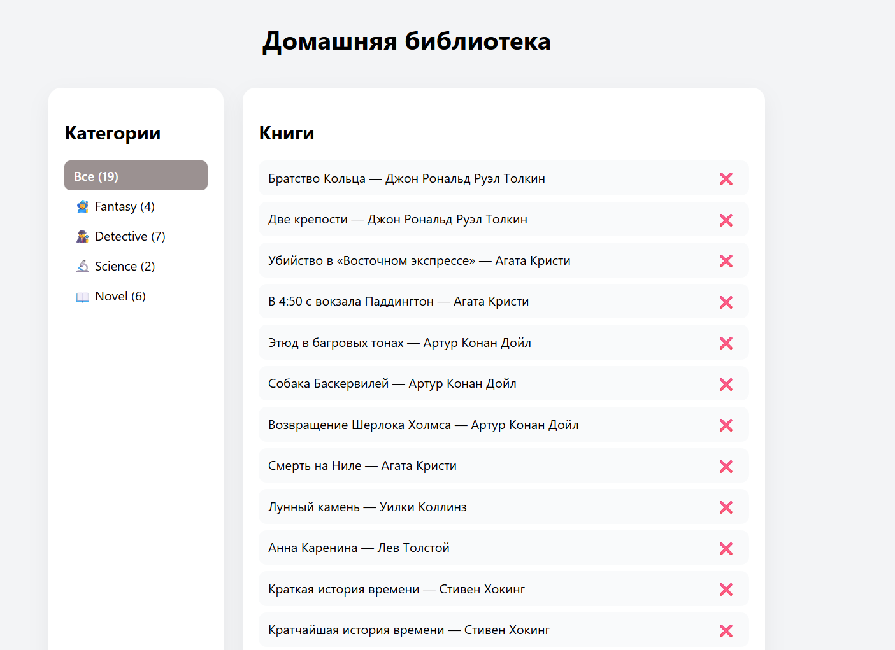

# ToDo App

Простое и удобное приложение для управления задачами.

## 🚀 Демо
https://to-do-2-1.vercel.app

## 📌 Функциональность

- Добавление задач
- Удаление задач
- Редактирование задач
- Фильтрация (все / активные / выполненные)
- Сохранение в localStorage
- Очистка выполненных задач

## 🛠️ Технологии

- React
- TypeScript
- Vite

## 📷 Скриншот




## ⚙️ Установка

```bash
npm install
npm run dev
