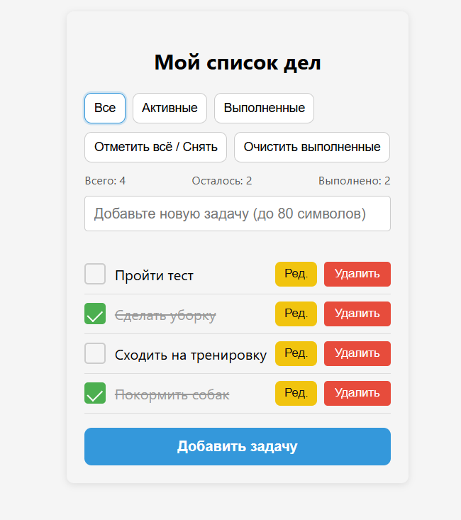
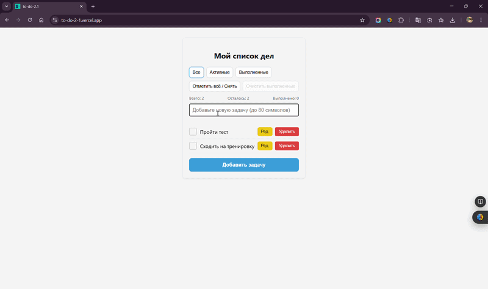

# ✅ ToDo App

A task management application built with React and TypeScript.

The project demonstrates CRUD operations, validation, filtering, and persistent state using localStorage.

---

## 🚀 Demo

https://to-do-2-1.vercel.app

---

## ✨ Features

- Add new tasks
- Edit existing tasks
- Delete tasks
- Mark tasks as completed
- Toggle all tasks
- Filter tasks (all / active / completed)
- Clear completed tasks
- Validation:
  - prevents empty tasks
  - prevents duplicate tasks
  - limits task length
- Data persistence using localStorage

---

## 🛠️ Tech Stack

- React
- TypeScript
- Vite
- CSS
- LocalStorage

---

## 📷 Screenshot



---

## 🎥 Demo



---

## 🧠 What I practiced

- State management with React hooks
- Controlled components (forms)
- CRUD operations
- Conditional rendering
- Working with lists and keys
- Validation logic
- LocalStorage integration
- Component structure and separation of concerns

---

## ⚙️ Run locally

```bash
npm install
npm run dev
```